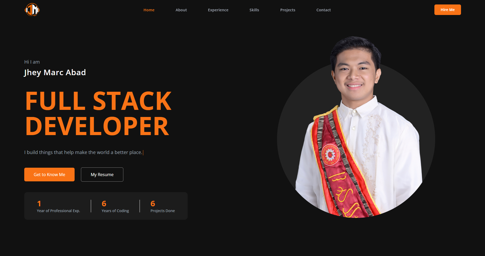

<div align="center">
  
# Jhey Marc Abad - Portfolio

A personal portfolio built with React and TypeScript, showcasing my journey as a developer, technical expertise, professional experience, and the applications I’ve built.

[](https://jmarc-dev.vercel.app/)

</div>

---

## Preview



## Tech Stack

| Technology | Purpose | Version |
|---|---|---|
| [React](https://react.dev/) | UI Library | 19 |
| [Typescript](https://www.typescriptlang.org/) | Type Safety | 6 |
| [Vite](https://vite.dev/) | Build Tool | 8 |
| [Tailwind CSS](https://tailwindcss.com/) | Styling | v4 |
| [Framer Motion](https://motion.dev/) | Animations | 12 |
| [React Router](https://reactrouter.com/) | Client-side Routing | v7 |
| [EmailJS](https://www.emailjs.com/) | Contact Form | 4 |
| [Lucide React](https://lucide.dev/) | Icons | 1 |
| [Vercel](https://vercel.com) | Deployment | 24 |

## Getting Started

### Prerequisites

Make sure you have the following installed:

- [Node.js](https://nodejs.org) - version 18 or higher
- npm - comes with Node.js

**1. Clone the repository**

```bash
git clone https://github.com/ShepherdBoyy/my-portfolio.git
cd my-portfolio
```

**2. Install dependencies**

```bash
npm install
```

**3. Set up environment variables**

```bash
cp .env.example .env
```

Then open `.env` and fill your [EmailJS](https://www.emailjs.com) credentials:

```env
VITE_EMAILJS_SERVICE_ID=your_service_id
VITE_EMAILJS_TEMPLATE_ID=your_template_id
VITE_EMAILJS_PUBLIC_KEY=your_public_key
```

**4. Start the development server**

```bash
npm run dev
```

Open [http://localhost:5173](http://localhost:5173) in your browser.

### Build for Production

```bash
npm run build
```

The output will be in the `dist/` folder.